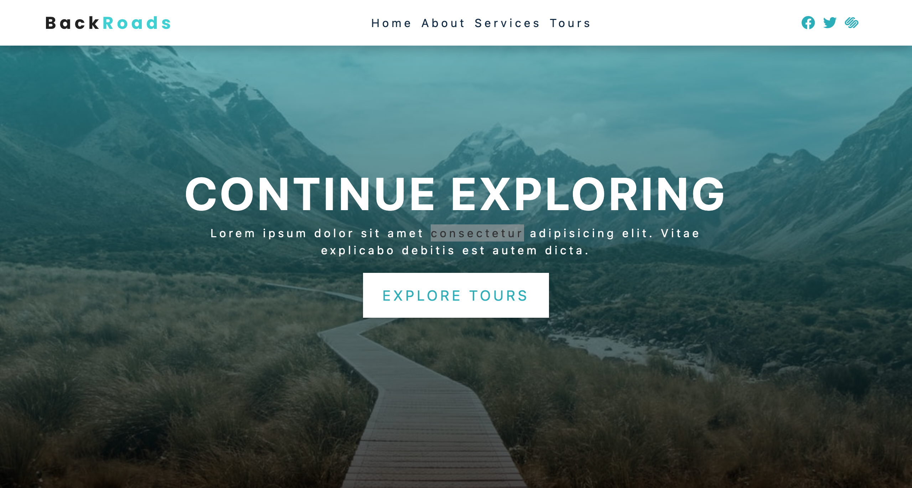

# Backroads

旅游网站的 Landing Page，用来熟悉 React 的 props 的项目，包括动态数据的导入，和动态的可重用的元素。



[View Demo →](https://react-backroads.vercel.app/)

## Smooth Scroll
用 Tailwind 添加`<html>`标签的样式：
```css
@layer base {
  html {
    scroll-behavior: smooth;
  }
  .section {
    /* Navbar Height */
    scroll-margin-top: 4rem;
  }
}
```

## Roadmap

- [ ] 用 Tailwind 重写样式